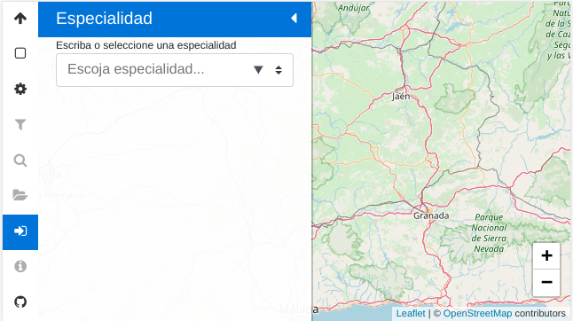
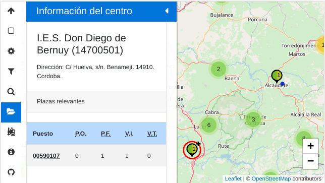
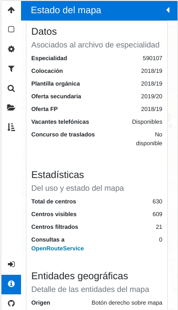

¿Qué es Lobatón?
*****************
*Lobatón* es un mapa interactivo que presenta la oferta educativa y las
adjudicaciones de destino de todos los centros públicos de Andalucía. En
principio, está restringido a los institutos de enseñanza secundaria y a los
cuerpos **590** y **591**, aunque tal restricción no es técnica, sino debida a
la limitación que impone no tener disponibles en la aplicación los datos del
resto de centros y cuerpos.

Se caracteriza por:

+ Representar cada centro mediante un icono, cuyos detalles visuales dependen
  de cuáles sean los datos de oferta y adjudicaciones.
+ Permitir la aplicación de filtros y correcciones a los datos para eliminar
  aquellas adjudicaciones, enseñanzas y centros que resulten irrelevantes.
+ Reflejar sobre el aspecto de los iconos la aplicación de tales filtros y
  correcciones.

La aplicación corre enteramente en el navegador cliente, de suerte que no
no se procesa información alguna en el servidor web.

Uso
***

Arranque
========
Nada más acceder a la aplicación, esta presenta un mapa vacío y nos insta a
escoger la especialidad objeto de la consulta:

.. note:: Si el mapa :ref:`no carga datos previos <datos-previos>`, el navegador
   nos pedirá permiso para conocer nuestra posición. El dato no es enviado a
   ningún lugar externo, sino que se toma simplemente para centrar el mapa en la
   ubicación del usuario. Si rechazamos la petición o no somos rápidos en
   responder, el mapa se centrará en un lugar más o menos céntrico de Andalucía
   y con un *zoom* que permite ver toda la Comunidad en el monitor de un
   ordenador de sobremesa.

Podemos escoger una especialidad tecleando algunas letras que compongan su
nombre:

.. image:: files/especialidad.png

La selección de una de ellas cargará los datos, los presentará en el mapa y
recogerá la barra lateral:

.. image:: files/cargados.png

En el mapa aparecerá dos tipos de iconos:

- Los iconos que representa centros individuales como el icono que se deja
  entrever en la esquina superior derecha de la captura.
- Los iconos que representan agrupaciones de centros y que dejan adivinar
  cuántos a través del número superpuesto que presentan.

.. note:: En el caso de dispositivos con un ancho de pantalla muy pequeño, como
   los teléfonos móviles en posición vertical, el panel lateral ocupa todo el
   espacio y no podrá verse el mapa hasta que no se repliegue la barra lateral.

Selección de centro
===================
La navegación por el mapa es trivial y semejante a la que se puede practicar en
otras herramientas de este estilo\ [#]_. Por su parte, las agrupaciones de
centros irán deshaciéndose al acercar el *zoom* o pulsar sobre los propios
iconos.

Si se quiere conocer la información en detalle de un centro basta con pulsar
sobre él: el icono aparecerá rodeado con un círculo rojo y se desplegará
automáticamente el panel lateral de información de centro:

Si nos fijamos en los iconos de la barra, veremos que aparecerán habilitados ya
todos. Los deshabilatos al principio eran aquellos con nula utilidad mientras no
hubiera datos cargados.

.. _panel-informacion:

Estado el mapa
==============
El estado del mapa puede consultarse pinchando sobre el icono de información y
presenta información sustanciosa sobre el propio mapa:

+ Una primera sección que refiere cuáles son los datos cargados y nos permite
  conocer si éstos están convenientemente actualizados.

+ Una segunda sección de estadísticas con mero carácter informativo.

+ Una tercera sección que muestra cuáles son las entidades geográficas que hemos
  definido definido sobre el mapa y que no da pistas de cuál es la siguiente
  acción que debemos llevar a cabo para crearlas. A ellas dedicaremos el
  siguiente epígrafe.

.. image:: files/info2.png

El último botón permite copiar en el portapapeles una |URL| que reproduce
automáticamente el estado actual del mapa, lo que nos permite compartir con
otros usuarios un estado que nos parezca relevante.

Entidades geográficas
=====================
Son las siguientes:

Centro seleccionado
   Ya descrito anteriormente.

Origen
   La aplicación permite definir un punto de origen que es útil cuando se
   quieren hacer valoraciones sobre la idoneidad de un centro basándose en la
   lejanía respecto a un punto de referencia. Para definirlo basta con pulsar
   con el botón derecho sobre el mapa (o pulsación larga en un dispositivo
   táctil) y elegir la opción en el menú contextual:

   .. image:: files/origen.png

   Las dos siguientes entidades sólo tienen sentido si previamente se ha fijado
   un origen de referencia.

Ruta
   Una ruta establece el camino entre el origen y un centro de destino
   arbitrario que puede o no coincidir con el seleccionado. Para crearla basta
   tener definido un origen y, una vez hecho, pinchar con el botón derecho sobre
   el centro de destino:

   .. image:: files/ruta.png

   La utilidad de la ruta, más allá de mostrar el itinerario, es la de declarar
   la distancia entre origen y destino y la duración del viaje. Creada la ruta,
   esa misma información puede obtenerse del :ref:`panel de información
   <panel-informacion>`.

Isocronas
   aa

Ajustes
=======

.. _datos-previos:

Filtros
=======

.. _faq:

|FAQ|
=====

.. rubric:: Notas al pie

.. [#] La principal diferencia con otras herramientas como `Google Maps
   <https://www.google.com>`_ es que un doble click derecho sobre el mapa no
   aleja la vista, sino que apra ello hay que hacer doble click mientras se
   pulsa la tecla :kbd:`Shift`.

.. |FAQ| replace:: :abbr:`FAQ (Frequently Asked Questions)`
.. |URL| replace:: :abbr:`URL (Uniform Resource Locator)`
